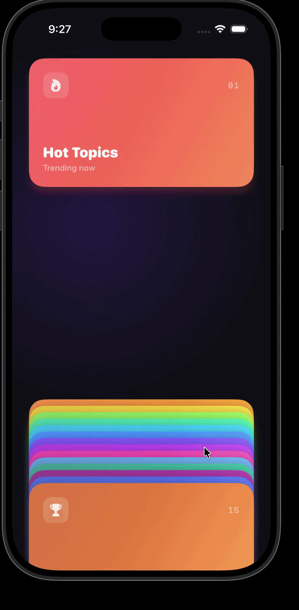

# CardStackKit


A SwiftUI component for rendering data collections as a stack of layered cards, with drag gestures, dynamic spacing, and configurable snap behavior.


---

## Requirements

- iOS 17+
- Swift 5.9+
- Xcode 15+

---

## Installation

### Swift Package Manager

In Xcode: **File → Add Package Dependencies**

```
https://github.com/alexgoodd/CardStackKit
```

Or add it manually to your `Package.swift`:

```swift
dependencies: [
    .package(url: "https://github.com/alexgoodd/CardStackKit", from: "1.0.0")
]
```

---

## Usage

### Vertical stack

```swift
import CardStackKit

CardStack(items: myCards, axis: .vertical, itemSize: 220) { card, ctx in
    RoundedRectangle(cornerRadius: 20)
        .fill(card.color)
        .frame(width: ctx.crossAxisSize, height: 220)
        .position(x: ctx.crossAxisPosition, y: ctx.mainAxisPosition + 110)
        .zIndex(ctx.zIndex)
}
.pendingVisible(5)
.spacing(min: 24, max: 60)
.activeAnchor(.center)
.stackPadding(top: 40, bottom: 40, leading: 24, trailing: 24)
```

### Horizontal stack

```swift
CardStack(items: myCards, axis: .horizontal, itemSize: 220) { card, ctx in
    RoundedRectangle(cornerRadius: 20)
        .fill(card.color)
        .frame(width: 220, height: ctx.crossAxisSize)
        // Swap x/y when using horizontal axis
        .position(x: ctx.mainAxisPosition + 110, y: ctx.crossAxisPosition)
        .zIndex(ctx.zIndex)
}
```

---

## Modifiers

| Modifier | Description | Default |
|---|---|---|
| `.pendingVisible(_ count:)` | Number of cards visible in the bottom pile | `5` |
| `.spacing(min:max:)` | Min and max spacing between cards in the top stack | `24...60` |
| `.pendingPeek(_ value:)` | How much each pending card peeks from behind the next | `10` |
| `.minPendingVisible(_ value:)` | Minimum space reserved for the pending pile | `80` |
| `.activeAnchor(_ anchor:)` | How far the active card can travel (`.top`, `.center`, `.free`) | `.center` |
| `.snapBehavior(_ behavior:)` | Snap to nearest card or settle freely (`.perCard`, `.free`) | `.perCard` |
| `.stackPadding(top:bottom:leading:trailing:)` | Padding between the stack and container edges | `40, 40, 24, 24` |

---

## Positioning guide

Each card receives a ``CardStackItemContext`` with the position values it needs.
You are responsible for applying them using `.position(x:y:)`.

`mainAxisPosition` is the **leading edge** of the card — add `itemSize / 2` to center it correctly, since `.position()` places the view's center at the given point.

**Vertical**
```swift
.frame(width: ctx.crossAxisSize, height: itemSize)
.position(x: ctx.crossAxisPosition, y: ctx.mainAxisPosition + itemSize / 2)
```

**Horizontal**
```swift
.frame(width: itemSize, height: ctx.crossAxisSize)
.position(x: ctx.mainAxisPosition + itemSize / 2, y: ctx.crossAxisPosition)
```

---

## License

CardStackKit is available under the MIT license. See the [LICENSE](LICENSE) file for more information.
